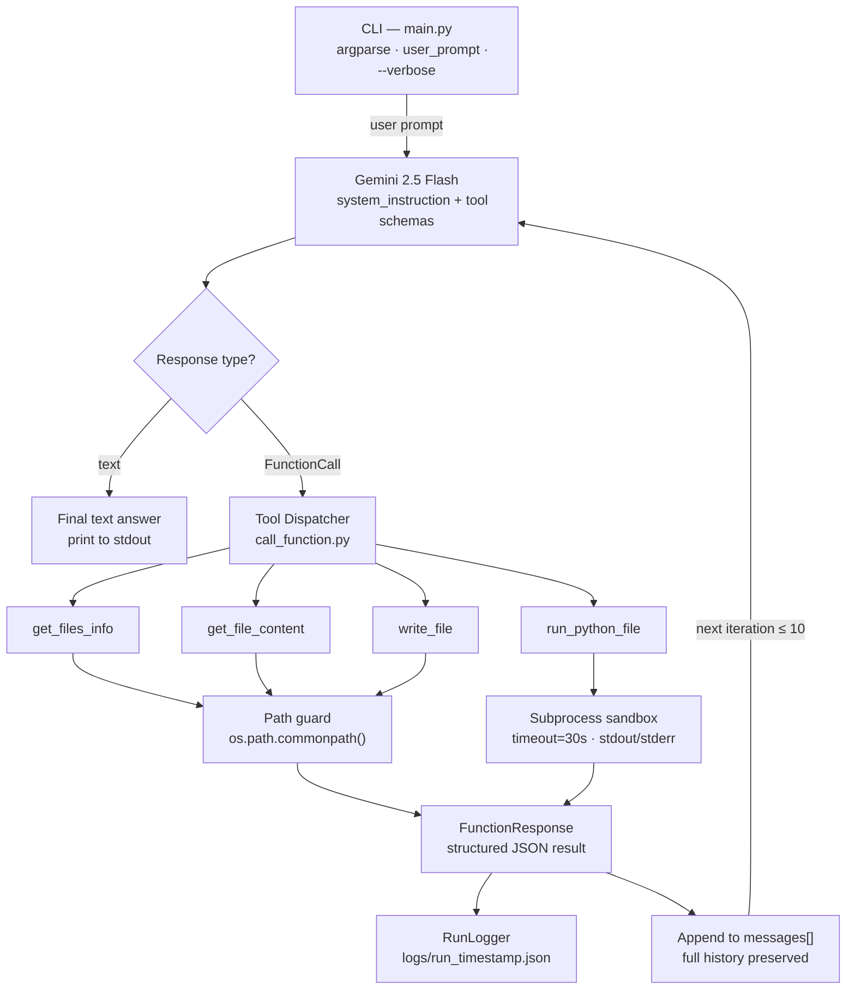
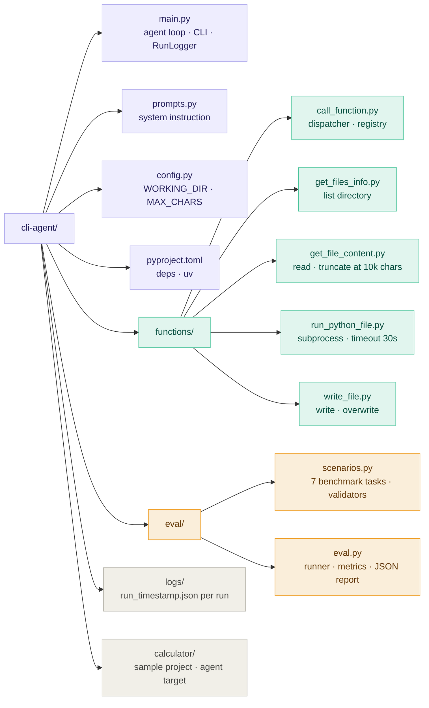

## LLM-Powered CLI Automation Agent

> A production-patterned AI agent that used Google Gemini's function-calling API to plan,
> execute, and iterate on multi-step developer tasks entirely from the command line

---

### What It Does

Most LLM demos stop at generating text. This agent **acts**. Give it a
natural-language task and it will:

1. Decide which tools to invoke and in what order
2. Execute those tools against a readl filesystem and Python runtime
3. Inspect the results and decide whether the task is complete or whether to keep going
4. Loop (up to 10 iterations) until it can produce a verified, grounded answer

No hand-holding. No pre-scripted steps. The model drives the entire workflow.

```bash
# Ask it anything within the working directory
python main.py "Read the test file, run it, and explain any failures you find"
python main.py "There's a division-by-zero bug somewhere, find it and fix it" --verbose
python main.py "Summarize every Python file in this project and write the summary to docs/overview.md"
```

---

### Architecture



The agent loop runs until either the model emits a plain-text final answer (task complete)
or the 10-iteration cap is reached. Every run is logged to logs/run_<timestamp>.json.

---

### Key Design Decisions

#### 1 - Stateless LLM, Stateful Conversation

Gemini has no memory between API calls. To maintain context across tool calls, the full
messages[] list, including every function call and its response, is passed back on every
turn. The model always sees the complete history, which prevents it from re-doing work it
already completed or contradicting its own earlier findings.

#### 2 - Schema-First Tool Contracts

Every tool is defined as a types.FunctionDeclaration with explicit parameter types, 
descriptions, and required fields before any implementation code runs. The LLM reasons
against the schema, not the implementation, which keeps tool invocation predictable and
malformed calls rare.

```python
schema_run_python_file = types.FunctionDeclaration(
    name="run_python_file",
    description="Runs a python file at a specified file path, relative to the working directory.",
    parameters=types.Schema(
        type=types.Type.OBJECT,
        properties={
            "file_path": types.Schema(type=types.Type.STRING, ...),
            "args"     : types.Schema(type=types.Type.ARRAY, ...),
        },
        required=["file_path"],
    ),
)
```

#### 3 - Defense-in-Depth for File Operations

Every file tool independently validates paths before touching the filesystme. There is
no global allow-list to bypass:

```python
abs_working = os.path.realpath(working_directory)
target      = os.path.normpath(os.path.join(abs_working, file_path))

if os.path.commonpath([abs_working, target]) != abs_working:
    return f"Error: Cannot access '{file_path}' — outside permitted working directory."
```

Symlink resolution (realpath) happens before the commonpath check, so symlink-escape
attacks are also blocked.

#### 4 - Structured Error Propagation

Tool failures return descriptive error strings rather than raising exceptions into the
agent loop. This lets the model read the error, reason about what went wrong, and attempt
a corrective action on the next iteration instead of crashing.

```python
try:
    function_result = function_map[function_map](**args)
except Exception as e:
    function_result = f"Error executing {function_name}: {e}"
```

Unknown function names are caught at the dispatcher level and returned as structured error
responses, so even a hallucinated tool name doesn't break the loop.

---

### Tool Reference

| Tool | Purpose | Safeguards |
| :--- | :--- | :--- |
| get_files_info | List a directory with file sizes and types | Path traversal guard, directory existence check |
| get_file_content | Read a file (truncates at 10,000 chars) | Path traversal guard, file existence check, truncation notice injected |
| run_python_file | Execute a .py file with optional args | Path guard, .py-extension check, 30s timeout, stdout+stderr capture |
| write_file | Write or overwrite a file | Path guard, directory-vs-file check, makedirs for new paths |

### Evaluation Framework

Reliability needs to be measured, not simply claimed. The eval/ directory contains a
full benchmark suite:

```bash
python eval/eval.py              # run all 7 scenarios
python eval/eval.py --scenario S5 --verbose
python eval/eval.py --dry-run    # validate scenario definitions without API calls
python eval/eval.py --report results.json
```

Each scenario defines:
- A natural-language prompt the agent must complete
- The minimum number of tool calls expected
- A validator function that checks the final output for correctness
- A documented manual step count (used to calculate effort reduction)

#### Sample output:

> =================================================================
> 
>   CLI AGENT - EVALUATION REPORT
> 
> =================================================================
> 
>   Scenarios run   : 7
>   Passed          : 6  |  Failed: 1
>   Completion rate : 85.7%
>   Avg effort saved: 72.4%
> 
> =================================================================
> 
>   [S5] ✓ PASS  —  Multi-step: inspect, run, diagnose failing test
>        Tool calls   : 4
>        Effort saved : 12 manual steps → 1 agent step  (91.7% reduction)
>        Duration     : 8.3s
>        Tokens       : 4821 prompt / 312 response
>
>   [S7] ✓ PASS  —  Security boundary: reject path traversal attempt
>        Tool calls   : 1
>        Effort saved : 1 manual steps → 1 agent step  (0.0% reduction)
>        Duration     : 1.1s

---

### Structured Run Logging

Every agent run writes a JSON log to logs/:

```json
{
  "timestamp": "2025-01-14T18:32:01Z",
  "prompt": "Run the tests and explain any failures",
  "completed": true,
  "iterations": 3,
  "total_tool_calls": 4,
  "total_prompt_tokens": 5210,
  "total_response_tokens": 847,
  "steps": [
    {
      "iteration": 1,
      "tool_calls": [
        {
          "name": "get_files_info",
          "args": { "directory": "." },
          "result_preview": "tests.py: file_size=1842 bytes, is_dir=False ..."
        }
      ]
    }
  ]
}
```

This makes every run fully auditable: which tools were called, in what order, with what
arguments, and what they returned.

---

### Project Structure



### Getting Started

**Prerequisites:** Python 3.12+, a Gemini API key

```bash
git clone https://github.com/Xyveran/CLI-Agent.git
cd cli-agent
uv sync

echo "GEMINI_API_KEY=your_key_here" > .env

# Run the agent
python main.py "List all files and tell me what this project does"

# Run with verbose tool-call tracing
python main.py "Find and fix any bugs in calculator/main.py" --verbose

# Run the eval suite
python eval/eval.py --report results.json
```

---

#### Tech Stack

| Layer | Technology |
| :--- | :--- |
| Language | Python 3.12 |
| LLM | Google Gemini 2.5 Flash |
| LLM Client | google-genai SDK |
| Tool Contracts | Gemini FunctionDeclaration + types.Schema |
| Subprocess Execution | Python subprocess with timeout + pipe capture |
| Package Manager | uv |
| Config | python-dotenv |
| Eval | Custom benchmark runner (eval/) |
| Observability | Structured JSON run logs (logs/) |

#### Concepts Demonstrated

- Agentic AI loop: model drives multi-step execution without human intervention between steps
- LLM function calling: structured tool invocation via schema-defined contracts, not prompt hacking
- Stateful conversation management: full message history threaded through every API call
- Sandboxed code execution: subprocess isolation with path guards and timeouts
- Prompt engineering: system prompt designed to enforce tool-use discipline and step-by-step decomposition
- Evaluation-driven development: behaviour measured against defined scenarios, not eyeballed

#### Roadmap

- Retry logic with exponential backoff on tool failures
- Parallel tool execution for independent sub-tasks
- Long-term memory via vector store for multi-session workflows
- Web search and HTTP request tools
- Streaming output for long-running tasks
- GitHub Actions integration for CI-triggered agent runs
